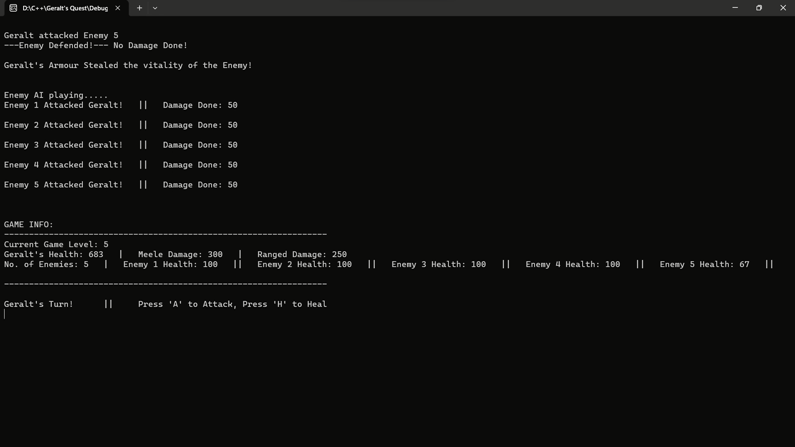

# Witcher-s-Quest-Console

### Overview

    - Embark on an epic text-based RPG adventure as Geralt, a skilled warrior on a quest to protect a besieged
      village. Face waves of enemies, unlock powerful abilities, and strategically navigate through challenging
      levels. Your ultimate goal: defeat the menacing boss Murloc and free the village from peril.
    
### Features

    - Dynamic Levels:
        - Progress through increasing difficulty levels, each with more enemies and challenges. 
        - Unlock new items, abilities, and special powers as you advance.

    - Strategic Turn-Based Combat:
        - Engage in turn-based combat with a variety of enemies.
        - Choose between attacking and healing strategically.

    - Unique Abilities:
        - Unlock special abilities like Critical Hit, Blocker, Life Steal, and Ranged Attack.
        - Each ability adds a layer of strategy to your gameplay.

    - Player Stats Progression:
        - Geralt's stats evolve with each completed level.
        - Increase health, damage, and unlock powerful items.

    - Enemy Encounters:
        - Face waves of enemies with increasing difficulty.
        - Defeat each level's enemies to progress.
        - Face a challenging boss in the final level.

### Screenshots
   
   
   
   
   
   

 ### Implementation
    - To organize the code, C++ and OOP concepts have been employed. The implementation is divided into multiple
      files:
   #### Enemy.cpp
    - The Enemy class represents an enemy entity in a game, with attributes such as health, damage, and defense.
    - It provides functionality for the enemy to attack a player, defend against attacks with a 20% probability,
      deal damage to the player, and check if the enemy is dead.
      
  #### LevelManager.cpp
    - The LevelManager class manages the game levels and turns, creating enemies based on the current level.
    - It provides functions to create enemies for each level, handle player and enemy turns, set the current level,
      and display game information.
      
  #### Main.cpp
     - Initializes game loop and level loop flags, creating a LevelManager instance for managing levels, player,
       and enemies.
     - Iterates through each level, creating enemies, handling player and enemy turns, and displays a game over
       message after completing all levels. 
       
  ### Player.cpp
     - The Player class manages the player's health, attacks, and special abilities.
     - It includes functions for attacking enemies, healing, dealing damage, handling special abilities, and
       increasing stats based on the game level completed.
  ### Murloc.cpp
    - The Murloc class represents a powerful opponent in a game.
    - It has functions to perform various attacks, including a Ground Dash and Speed Dash, each with different damage
       multipliers. The class also includes health regeneration capabilities and a probability function to determine
       attack types.
       
### How to Play

    1. Run the game in a console window.
    2. Navigate through levels by defeating enemies strategically.
    3. Choose between attacking ('A') and healing ('H') during Geralt's turn.
    4. Unlock new abilities and items as you progress.
    5. Face the ultimate boss in the final level to complete the quest.

    - Player Information:

    - Player Stats:
        Max Health: 500 (Increases with each level)
        Heal: 100
        Melee Damage: 90
        Ranged Damage: 30

    - Special Abilities:
        - Critical Hit: Doubles melee damage for a devastating attack.
        - Blocker: Uses a shield to block incoming attacks.
        - Life Steal: Steals vitality from enemies to replenish health.
        - Ranged Attack: Performs a ranged attack, avoiding damage in return.
        
### Gameplay Demonstration
    - For a visual demonstration of the gameplay, watch video on YouTube:
 [Youtube video link](https://youtu.be/WsdcdMHvd6w)       
 
### Play the Game
    - To experience the game firsthand, play it by downloading folloling .exe file:
[Download .exe file](https://drive.google.com/file/d/1C5WLcJJITjT6m9D-VI1Cw6TEVKorwCYZ/view?usp=sharing)
